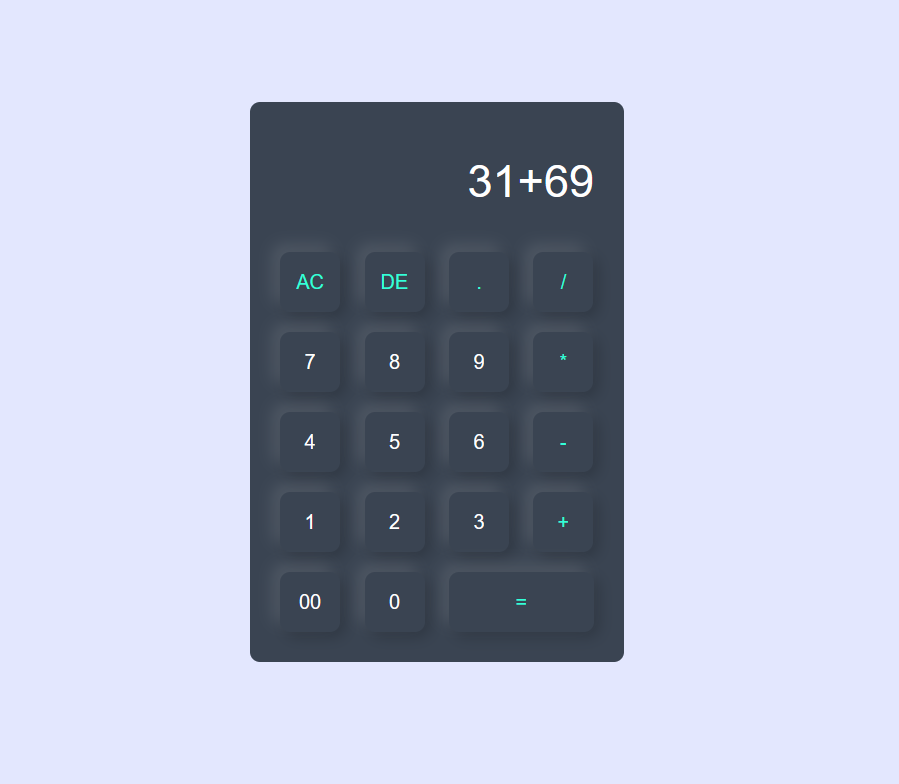

# Einfacher Taschenrechner

Dies ist ein einfaches HTML/CSS/JavaScript-Projekt, das einen einfachen Taschenrechner erstellt. Der Taschenrechner ermöglicht grundlegende mathematische Berechnungen wie Addition, Subtraktion, Multiplikation, Division und Prozentrechnung.

## Vorschau



## Verwendung

1. Klonen Sie dieses Repository auf Ihren lokalen Computer:

   ```bash
   git clone https://github.com/your-username/calculator.git
Öffnen Sie die index.html-Datei in Ihrem Webbrowser.

Verwenden Sie den Taschenrechner, um mathematische Operationen durchzuführen. Die Tasten sind intuitiv beschriftet und entsprechen den mathematischen Operationen.

Funktionen
Addition (+): Fügen Sie zwei Zahlen zusammen, indem Sie die +-Taste verwenden.

Subtraktion (-): Subtrahieren Sie zwei Zahlen, indem Sie die --Taste verwenden.

Multiplikation (*): Multiplizieren Sie zwei Zahlen, indem Sie die *-Taste verwenden.

Division (/): Teilen Sie zwei Zahlen, indem Sie die /-Taste verwenden.

Prozentrechnung: Um den Prozentsatz einer Zahl zu berechnen, geben Sie zuerst die Zahl ein, drücken Sie dann %, und schließlich eine weitere Zahl, gefolgt von der =-Taste.

Löschen (AC): Löschen Sie den aktuellen Bildschirm, indem Sie die AC-Taste verwenden.

Zurück (DE): Löschen Sie das letzte eingegebene Zeichen, indem Sie die DE-Taste verwenden.

Punkt (.): Verwenden Sie den Punkt, um Dezimalstellen einzugeben.

Anpassung
Sie können das Aussehen des Taschenrechners anpassen, indem Sie die style.css-Datei bearbeiten. Ändern Sie die Farben, Schriftarten und Layouts nach Ihren Wünschen.
